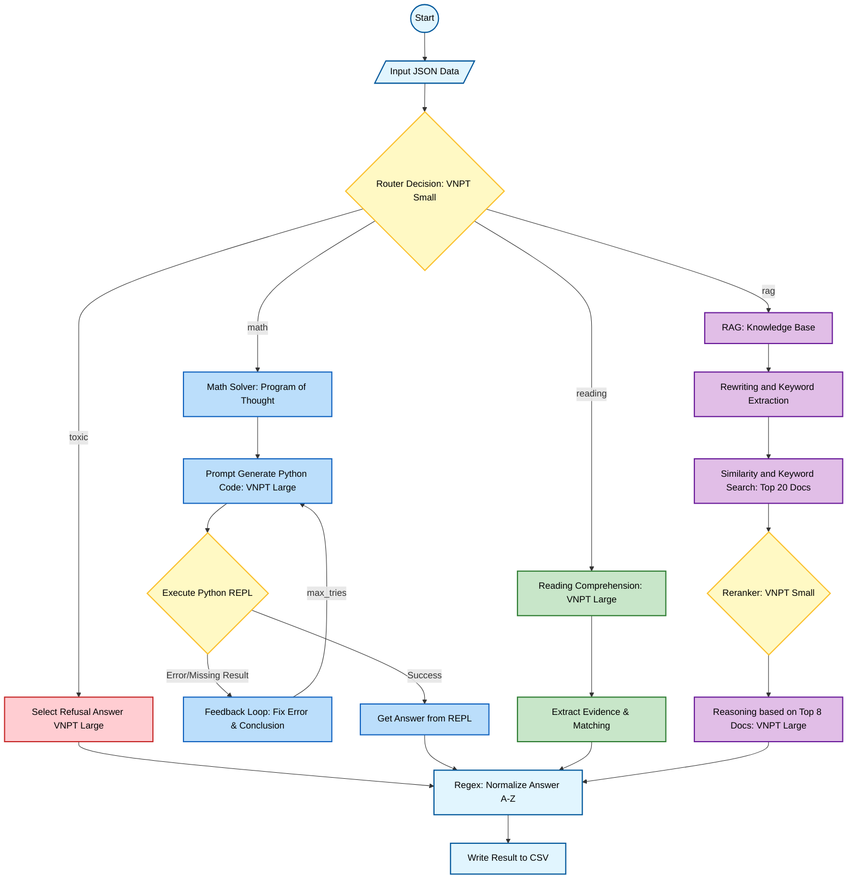

# 1. Pipeline



## 🛠 Tech Stack

| Component | Implementation |
| :--- | :--- |
| **Orchestration** | **LangChain, LangGraph**|
| **Main LLM (Reasoning)** | **VNPT LLM Large** |
| **Router / Classifier** | **VNPT LLM SMALL** |
| **Vector Database** | **Qdrant** |
| **Retrieval Strategy** | Hybrid (BM25 + Vector) + **LLM-based Reranking** |
| **Code Execution** | **PythonREPL** (LangChain Experimental Sandbox) |
| **Math Solver** | **Program of Thought (PoT)** w/ Self-Correction Loop |
| **Data Processing** | Regex, JSON, Pandas (CSV handling) |
| **Environment** | Python 3.12+, `python-dotenv` |

# 2. Data Processing

```mermaid
graph LR
    %% Định nghĩa Style cho từng nhóm Node
    classDef yellowNode fill:#fef3c7,stroke:#f59e0b,stroke-width:2px,color:#1a1a1a,font-weight:bold
    classDef blueNode fill:#60a5fa,stroke:#3b82f6,stroke-width:1px,color:#ffffff
    classDef purpleNode fill:#c084fc,stroke:#a855f7,stroke-width:1px,color:#ffffff
    classDef dbNode fill:#fef3c7,stroke:#f59e0b,stroke-width:2px,color:#1a1a1a,font-weight:bold

    %% Nodes
    Sources{"Sources"}:::yellowNode
    
    subgraph Prep [Ingestion & Preparation]
        Ingest["Ingest"]:::blueNode
        Clean["Clean"]:::blueNode
        Tokenize["Tokenize"]:::blueNode
    end
    
    subgraph Vector [Vectorization & Storage]
        Chunk["Chunk"]:::purpleNode
        Encode["Encode"]:::purpleNode
        Encode2["Encode"]:::purpleNode
    end

    Qdrant(("Qdrant DB")):::dbNode

    %% Luồng dữ liệu và kết nối
    Sources ==> Ingest
    Ingest --> Clean
    Clean --> Tokenize
    Tokenize --> Chunk
    Chunk --> Encode
    Encode --> Encode2
    Encode2 ==> Qdrant

    %% Style cho khung Subgraph
    style Prep fill:#1e3a8a,stroke:#60a5fa,stroke-width:2px,stroke-dasharray: 5 5,color:#ffffff
    style Vector fill:#581c87,stroke:#a855f7,stroke-width:2px,stroke-dasharray: 5 5,color:#ffffff

    %% Chỉnh màu mũi tên
    linkStyle default stroke:#cbd5e1,stroke-width:2px
```



## Data Processing and Crawling

This project expects source text (e.g. `.txt` files) or crawled website content to be normalized, semantically chunked, encoded (dense + sparse), and then indexed into Qdrant for RAG/QA usage.

Goals: 
- Normalize raw content (clean HTML/URLs/whitespace).
- Produce semantically-coherent chunks suitable for embedding and retrieval.
- Store both dense and sparse representations for hybrid search.

1. Overview of the pipeline
    - Source data: `.txt` files under `settings.DATA_DIR` (or a `crawl` subfolder) and crawler outputs. See `scripts/ingest_data.py`.
    - Cleaning: remove HTML tags, strip URLs, collapse extra whitespace. See `src/database/splitter.py` `_clean_text()`.
    - Sentence splitting: use `underthesea.sent_tokenize()` for Vietnamese sentence tokenization before chunking.
    - Semantic chunking: encode sentences, group adjacent sentences when cosine similarity >= threshold (default 0.6) to form chunks. Implemented in `src/database/splitter.py` `SemanticSplitter.split_text()`.
    - Hybrid encoding: dense embeddings via `VNPTEmbeddingWrapper` and sparse indices produced by hashing tokens (CRC32 % 20000). The hybrid encoder and Qdrant upsert live in `src/database/hybrid_qdrant.py`.
    - Indexing: chunks are batched (default `BATCH_SIZE = 32` in `scripts/ingest_data.py`) and upserted to the `vnpt_rag_final` collection in Qdrant.

2. Key technical details
    - Cleaning (example patterns)
    - HTML removal: `<[^>]+>`
    - URL removal: `https?://\S+|www\S+`
    - Collapse whitespace and strip leading/trailing spaces
    - See `clean_markdown()` example in `scripts/Crawl_Data/[VNPT_AI]_FireCrawl.ipynb` for a sample cleaning function used after scraping.

    - Crawling & scraping (Firecrawl)
    - The project includes a Firecrawl demo in `scripts/Crawl_Data/[VNPT_AI]_FireCrawl.ipynb` which demonstrates:
        - `app.scrape(url, formats=[...], only_main_content=True)` to extract page content (markdown, summary, links, screenshots).
        - `app.crawl(url, limit=..., scrape_options={...})` to recursively crawl a site with `limit`, `include_paths`, `exclude_paths`, and `allowed_domains` filters.
        - `app.map(url, search=topic, limit=...)` to discover topic-related URLs and feed them into a `map + scrape` workflow.
    - Cleaning after scraping: remove markdown links/images, inline HTML, and raw URLs (see `clean_markdown` in the notebook). Use rate-limiting (e.g., sleep 1–3s between requests) and handle exceptions per-URL to keep the crawler robust.
    - Extraction (structured): Firecrawl supports AI-powered `extract()` where you pass a JSON schema (Pydantic) and the API returns a structured object for each page. See the notebook examples with `ArticleInfo` and `VietnamLawInfo` schemas.

    - Wikipedia crawling (local collection)
    - `scripts/Crawl_Data/Wiki_Data_crawling.ipynb` shows a simple approach using the `wikipedia` Python package:
        - Set language (`wikipedia.set_lang('vi')`), fetch `page.content`, and append to a local corpus file (e.g. `corpus_wikipedia.txt`).
        - Build a list of topics and iterate to collect pages into a single text corpus.
        - Later, create `Document` objects and run semantic splitting (Llama-Index `SemanticSplitterNodeParser` example or a custom `semantic_splitting_v2` implementation) using HuggingFace embeddings.

    - Semantic chunking algorithm (pattern used across notebooks and `src`)
    - Encode sentences (batch encode for speed).
    - Iterate adjacent sentences, compute cosine similarity between the previous and current sentence embeddings.
    - If similarity >= threshold (default 0.6), append to current chunk; otherwise start a new chunk.
    - Return chunks by joining sentences per chunk.

    Best practices when crawling and processing
    - Respect `robots.txt` and site terms of service.
    - Use polite rate-limiting (1–3s between requests) and exponential backoff for transient errors.
    - Persist raw HTML/markdown and also store cleaned text for reproducibility.
    - Validate and deduplicate URLs to avoid indexing identical content.
    - Monitor chunk lengths and adjust the semantic threshold or sentence tokenizer to improve chunk coherence.

3. Running the pipeline (quick start)
    1. Install dependencies:

    ```powershell
    pip install -r requirements.txt
    ```

    2. Configure `src/config.py` / `settings`:
    - `DATA_DIR`: path to your `.txt` or crawl outputs.
    - `DB_PATH`: Qdrant storage path (if using file-backed storage).
    - VNPT embedding tokens/keys if using the VNPT wrapper.

    3. Run the ingestion process (reads `.txt`, chunks, encodes, indexes):

    ```powershell
    python scripts/ingest_data.py
    ```

    Notes and tuning
    - Remember to adjust the path of the raw data you want to ingest
    - Batch size: change `BATCH_SIZE` in `scripts/ingest_data.py`.
    - Chunk similarity threshold: pass a different `threshold` to `SemanticSplitter` (e.g., 0.5–0.7) to tune chunk granularity.
    - Sparse hashing: the project uses `zlib.crc32(token) % 20000` for sparse indices—adjust modulus if you need a larger sparse dimension.

4. Relevant files
    - `scripts/ingest_data.py` - Main ingestion script that processes .txt files
    - `scripts/json_splitter.py` - JSON data splitting utilities
    - `scripts/Crawl_Data/[VNPT_AI]_FireCrawl.ipynb` - Firecrawl web scraping examples
    - `scripts/Crawl_Data/Wiki_Data_crawling.ipynb` - Wikipedia data collection examples
    - `src/database/splitter.py` - Semantic chunking implementation (`SemanticSplitter`)
    - `src/database/hybrid_qdrant.py` - Hybrid encoder and Qdrant database operations

# 3.  Resource Initialization

Vector Database has already built and containerized in Docker at: ```/data/qdrant_storage/```


# 4. Environment Variables
The keys used for running the container:

## 4.1. Large Language Model
- ```VNPT_TOKEN_ID_LARGE```
- ```VNPT_API_KEY_LARGE```
- ```VNPT_ACCESS_TOKEN_LARGE```


## 4.2. Small Language Model
- ```VNPT_TOKEN_ID_SMALL```
- ```VNPT_API_KEY_SMALL```
- ```VNPT_ACCESS_TOKEN_SMALL```

## 4.3. Embedding Model
- ```VNPT_TOKEN_ID_EMBED```
- ```VNPT_API_KEY_EMBED```
- ```VNPT_ACCESS_TOKEN_EMBED```

You must have the Embedding Model API Key despite inferencing 
