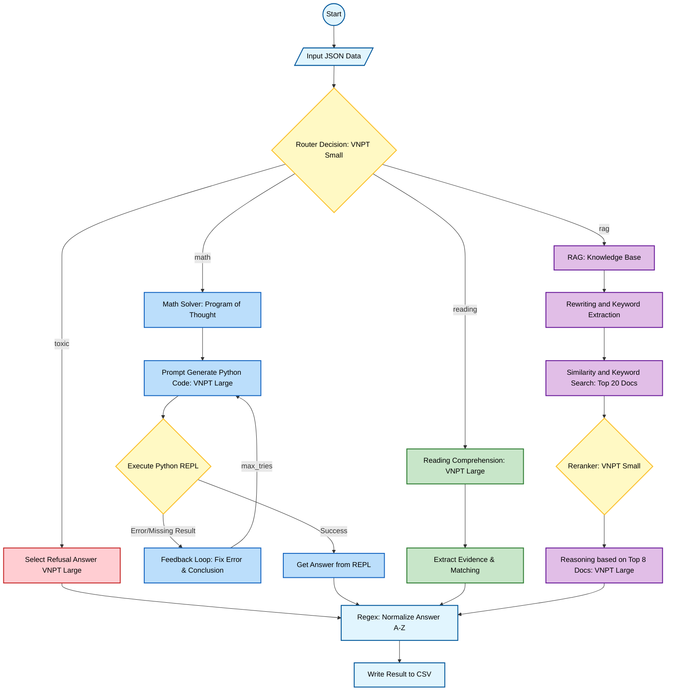

# 1. Pipeline



## 🛠 Tech Stack

| Component | Implementation |
| :--- | :--- |
| **Orchestration** | **LangChain, LangGraph**|
| **Main LLM (Reasoning)** | **VNPT LLM Large** |
| **Router / Classifier** | **VNPT LLM SMALL** |
| **Vector Database** | **Qdrant** |
| **Retrieval Strategy** | Hybrid (BM25 + Vector) + **LLM-based Reranking** |
| **Code Execution** | **PythonREPL** (LangChain Experimental Sandbox) |
| **Math Solver** | **Program of Thought (PoT)** w/ Self-Correction Loop |
| **Data Processing** | Regex, JSON, Pandas (CSV handling) |
| **Environment** | Python 3.12+, `python-dotenv` |

# 3.  Resource Initialization

Vector Database has been already built and containerized in Docker at: ```/data/qdrant_storage/```